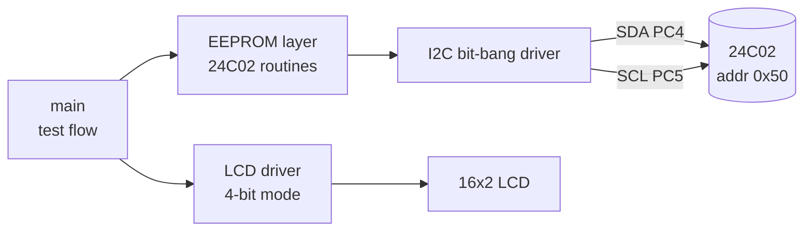

# I2C_BitBang_EEPROM
Bit-banged I2C master for ATmega328P: 24C02 EEPROM + 16x2 LCD (Embedded C, AVR Assembly, Proteus)
# I2C Bit-Bang Master: 24C02 EEPROM with LCD

An I2C master built from scratch by bit-banging two GPIO pins (SDA = PC4, SCL = PC5)
on an ATmega328P (Arduino Uno). It writes and reads a 24C02 EEPROM and shows the
data on a 16x2 LCD. Written in Embedded C with an AVR assembly delay routine.
Simulated in Proteus.

## Block diagram

## Simulation result

## Hardware (simulated)

| Signal | MCU pin |
|---|---|
| SDA | PC4 (4.7k pull-up to 5V) |
| SCL | PC5 (4.7k pull-up to 5V) |
| LCD RS / E | PB4 / PB3 |
| LCD D4-D7 | PD5 / PD4 / PD3 / PD2 |
| Status LED | PB5 |

24C02: WP on ground, device address 0xA0 (write) / 0xA1 (read).

## Software layers

| Layer | Functions |
|---|---|
| gpio | `sda_high/low`, `scl_high/low` (open-drain through DDR) |
| i2c | `i2c_start`, `i2c_stop`, `i2c_write`, `i2c_read` |
| eeprom | `ee_write` (with ACK polling), `ee_read` (random read) |
| lcd | `lcd_init`, `lcd_cmd`, `lcd_char`, `lcd_print`, `lcd_hex` |
| assembly | `delay_5us` (80 cycles at 16 MHz) |

## Test results

| Test | Expected | Result |
|---|---|---|
| Write 0xA5 to address 0x10, read back | `W:A5 R:A5`, status LED on | Pass |
| LCD display | `EEPROM OK` on line 2 | Pass |
| Assembly delay inside the I2C driver | Same result as the C delay | Pass |

## Files

- `New Project.pdsprj`: Proteus project
- `i2c_eeprom_lcd_copy_...ino`: firmware source
- `...hex`: compiled firmware loaded into the ATmega328P in Proteus

## How to run

1. Open the `.pdsprj` in Proteus.
2. Double-click the ATmega328P, set **Program File** to the `.hex` from this repo, and set the clock to 16 MHz.
3. Press Play. The LCD should show `W:A5 R:A5` and `EEPROM OK`.
